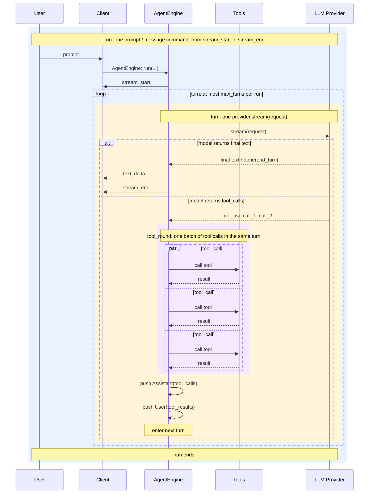

# Core Concepts

This document defines the runtime units used by aionrs. These terms matter
because user-facing protocol events, model calls, and tool execution operate at
different levels.

## Runtime Units

| Term                        | Meaning                                                                                                                                          |
| --------------------------- | ------------------------------------------------------------------------------------------------------------------------------------------------ |
| **Run**                     | One user prompt or host `message` command, from `stream_start` to `stream_end`. This is one `AgentEngine::run(...)` execution.                   |
| **Turn**                    | One LLM round trip inside a run: build request, call `provider.stream(...)`, consume the stream.                                                  |
| **Tool round**              | The optional batch of tool work requested by one turn. A turn has either zero or one tool round.                                                  |
| **Tool call + Tool result** | One tool request and the matching tool result returned to the model.                                                                              |

The multiplicity is:

```text
run 1:N turn
turn 0:1 tool_round
tool_round 1:N tool_call_result_pair
tool_call_result_pair = tool_call + tool_result
```

The internal loop is an implementation detail inside one run. It repeats turns
until the model produces a final answer, the user aborts, or a runtime guard
stops the run.

## Diagram



## Example

If a user asks aionrs to inspect and edit a file, one run might contain:

```text
Turn 1:
  The model asks for Read and Grep.
  The engine executes one tool round with two tool call/result pairs.

Turn 2:
  The model asks for Edit.
  The engine executes one tool round with one tool call/result pair.

Turn 3:
  The model returns final text with no tool calls.
  The engine emits stream_end.
```

That run had:

```text
turns: 3
tool rounds: 2
tool call/result pairs: 3
```

## Runtime Limit Semantics

`max_turns` is the broad non-convergence limit for one run:

```toml
max_turns = 20
```

means:

```text
max model turns per run = 20
```

Setting `max_turns = 0` disables this broad turn limit.

The limit applies to turns, not individual tool calls. If one turn requests
three tools, that consumes:

```text
turns: 1
tool rounds: 1
tool call/result pairs: 3
```

This keeps long but productive tool batches from exhausting the turn budget too
quickly while still bounding the number of model round trips in one run.

## Public Names

| Name                             | Meaning                                      |
| -------------------------------- | -------------------------------------------- |
| `max_turns`                      | Maximum model turns per run.                 |
| `AgentResult.turns`              | Number of counted normal turns in the run.   |
| `StopReason::MaxTurns`           | The run hit the turn limit.                  |
| Terminal output `[turns: N ...]` | Number of model turns completed in the run.  |
