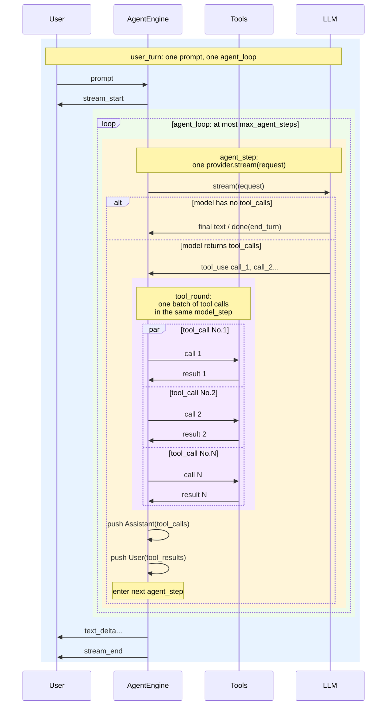

# Core Concepts

This document defines the runtime units used by aionrs. These terms matter
because user-facing protocol events and the internal agent loop operate at
different levels.

## Runtime Units

| Term                        | Meaning                                                                                                                                                                                |
| --------------------------- | -------------------------------------------------------------------------------------------------------------------------------------------------------------------------------------- |
| **User turn**               | One user prompt or host `message` command, from `stream_start` to `stream_end`. This is also one `AgentEngine::run(...)` execution. Internally that execution contains one agent loop. |
| **Agent step**              | One LLM round trip inside the agent loop: build request, call `provider.stream(...)`, consume the stream.                                                                              |
| **Tool round**              | The optional batch of tool work requested by one agent step. A step has either zero or one tool round.                                                                                 |
| **Tool call + Tool result** | One tool request and the matching tool result returned to the model.                                                                                                                   |

The multiplicity is:

```text
user_turn 1:N agent_step
agent_step 0:1 tool_round
tool_round 1:N tool_call_result_pair
tool_call_result_pair = tool_call + tool_result
```

`agent_loop` is not a separate runtime unit. It is the implementation mechanism
inside one user turn that repeats agent steps until the turn finishes or hits a
limit.

## Diagram



## Example

If a user asks aionrs to inspect and edit a file, one user turn might contain:

```text
Step 1:
  The model asks for Read and Grep.
  The engine executes one tool round with two tool call/result pairs.

Step 2:
  The model asks for Edit.
  The engine executes one tool round with one tool call/result pair.

Step 3:
  The model returns final text with no tool calls.
  The engine emits stream_end.
```

That user turn had:

```text
agent steps: 3
tool rounds: 2
tool call/result pairs: 3
```

## Current Naming Compatibility

Some existing public names use `turn` for historical reasons even though they
count agent steps:

| Current name                     | What it counts today                        |
| -------------------------------- | ------------------------------------------- |
| `max_turns`                      | Maximum agent steps per user turn.          |
| `AgentResult.turns`              | Number of agent steps completed in the run. |
| `StopReason::MaxTurns`           | The run hit the agent-step limit.           |
| Terminal output `[turns: N ...]` | Number of agent steps, not user turns.      |

For current configuration, read:

```toml
max_turns = 20
```

as:

```text
max agent steps per user turn = 20
```

Setting `max_turns = 0` disables this broad step limit. The name remains
available for compatibility.

## Runtime Limit Semantics

The broad non-convergence limit applies to agent steps, not individual tool
calls. If one model step requests three tools, that consumes:

```text
agent steps: 1
tool rounds: 1
tool call/result pairs: 3
```

This keeps long but productive tool batches from exhausting the step budget
too quickly while still bounding the number of model round trips in one user
turn.
